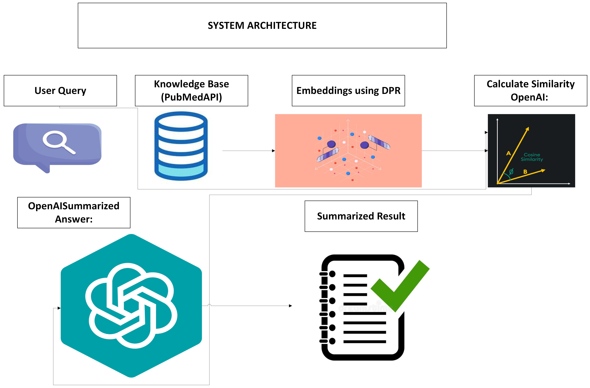

# AI-based-Chatbot-for-BioMedical-Research-Powered-by-Retrieval-Augmented-Generation

## Project Overview
This project involves developing a chatbot specifically tailored for biomedical research, aimed at assisting researchers and clinicians by providing accurate, context-rich answers. The system leverages state-of-the-art machine learning models to retrieve and generate information from a corpus of biomedical research papers, enhancing the decision-making and discovery processes in life sciences.

### System Architecture

## Key Features
- **Dense Passage Retriever (DPR)**: Utilized for embedding user queries and research paper abstracts for efficient retrieval of relevant documents.
- **Generative Model Integration**: GPT-3.5 Turbo is employed via the OpenAI API to generate coherent and accurate responses based on retrieved documents.
- **Baseline Comparison**: BERT is used for generating embeddings and responses as a baseline for performance evaluation.
- **Performance Metrics**: Evaluation includes cosine similarity, BERT score, fluency analysis, and ROUGE scores to compare RAG-based and BERT-based models.

## Dataset
- **Source**: The dataset is sourced from BIOASQ, comprising over 5000 records across various biomedical topics.
- **Subset**: Due to resource constraints, a subset of 200 records was used for training and testing.
- **Content**: Includes abstracts and ideal answers related to diverse biomedical challenges.

## Workflow
1. **Data Preprocessing**: Biomedical abstracts and questions were cleaned and structured.
2. **Embedding Generation**: 
   - **DPR**: Generated embeddings for user queries and research paper abstracts.
   - **BERT**: Used as a baseline for model comparision.
3. **Information Retrieval**: Relevant documents were retrieved by comparing the cosine similarity of query and abstract embeddings.
4. **Response Generation**: GPT-3.5 generated responses based on top-k retrieved documents.
5. **Performance Evaluation**: Metrics were calculated for both RAG and BERT-based approaches.

## Results
- **Cosine Similarity Distribution**: 
  - Visualized using histograms and violin plots for both RAG and BERT-based models.
- **Comparison of Metrics**:
  - RAG demonstrated higher relevance and fluency scores compared to BERT, indicating better contextual understanding.

## Visualization
- **Cosine Similarity Histogram**: Displays the similarity between the ideal answers and model responses.
- **Violin Plots**: Compare the distribution of similarity scores for RAG and BERT.
- **Bar Chart**: Highlights the performance across metrics for RAG and BERT.
!(images/System_Architecture.jpeg)

## Future Directions
- Scale the system to handle larger datasets.
- Incorporate advanced retrieval techniques and multimodal data.
- Fine-tune the generative model on domain-specific data.
- Extend applicability to real-time clinical environments and integrate with EHRs.